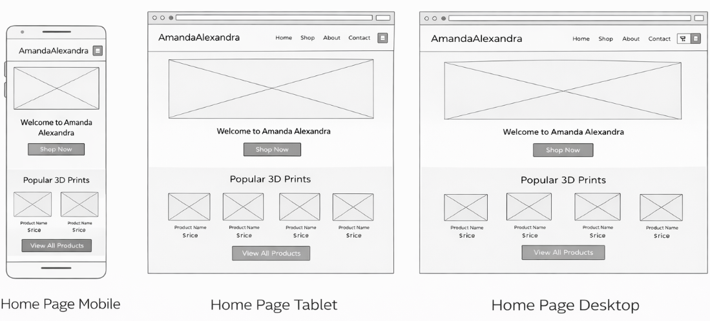
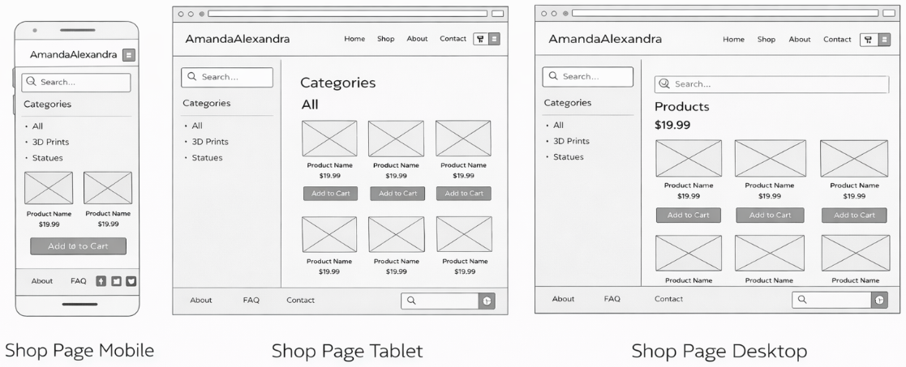
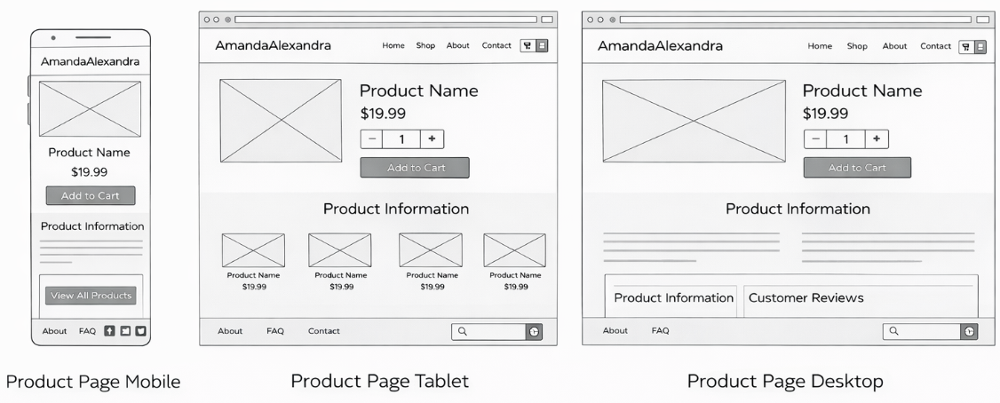
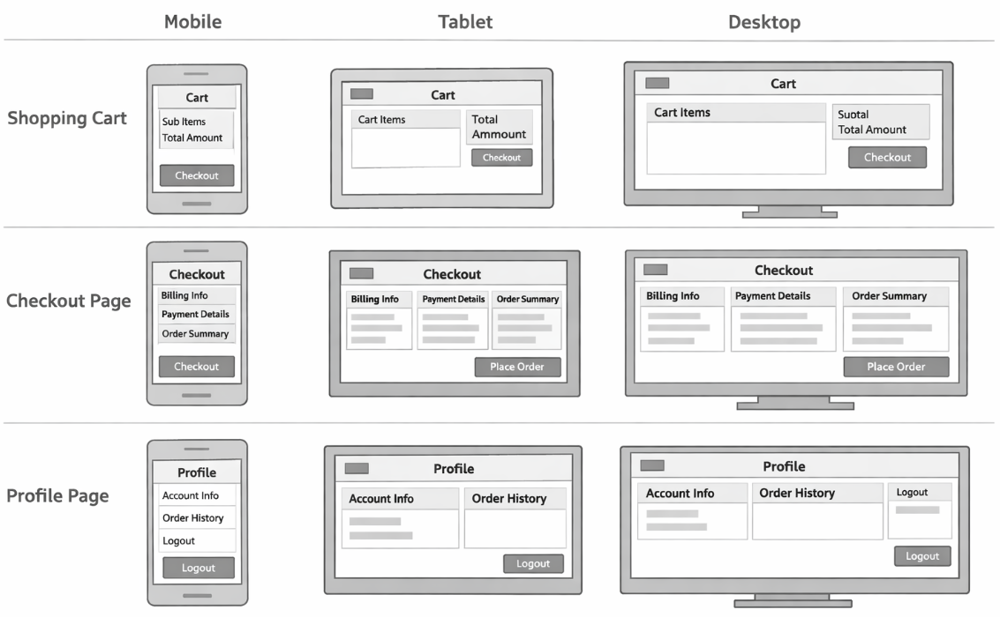

# AmandaAlexandra – 3D Print Shop
Live Site: Coming soon (deployment in progress)


## Project Overview

AmandaAlexandra is an e-commerce platform for selling custom 3D printed products.
The website allows users to browse products, create accounts, and securely
purchase items online using Stripe.

The target audience is individuals interested in unique, aesthetic, and custom
3D printed accessories and decorations.

The platform is designed to support small-scale digital manufacturing and
provide customers with personalized products.

---

## User Goals

- Easily browse and purchase 3D printed products
- View clear product images and descriptions
- Search, filter, and sort products efficiently
- Complete secure online payments
- Access order history through a personal account
- Use the website on mobile, tablet, and desktop devices
- Feel confident using a secure and reliable platform

---

## Site Owner Goals

- Sell 3D printed products online
- Manage products and categories
- Track customer orders
- Build the AmandaAlexandra brand
- Provide a smooth and professional shopping experience
- Create a scalable online business

---

## User Stories

### Viewing and Navigation
- As a shopper, I want to view a list of products so that I can choose items to purchase.
- As a shopper, I want to view product details so that I can make informed decisions.
- As a shopper, I want to search products by keyword so that I can find items quickly.
- As a shopper, I want to filter products by category so that I can narrow down my choices.
- As a shopper, I want to sort products by price, rating, or category so that I can browse efficiently.
- As a shopper, I want to see how many products match my search or filters.

### Account Management
- As a user, I want to register and log in so that I can access my profile.
- As a user, I want to view my order history so that I can track my purchases.
- As a user, I want to reset my password if I forget it.

### Purchasing
- As a shopper, I want to add items to my cart so that I can purchase multiple products.
- As a shopper, I want to securely pay for my order using Stripe.
- As a shopper, I want to checkout as a guest so that I can purchase without creating an account.

### Administration
- As a site owner, I want to add, edit, and delete products so that I can manage my store.
- As a site owner, I want to view customer orders.

---

## User Experience (UX)

### Strategy Plane
The website is designed for users who want to purchase stylish and custom 3D printed
products online. The main goal is to provide a simple, secure, and visually appealing
shopping experience.

Accessibility and ease of use were considered to ensure the website can be used by a wide audience.

### Scope Plane
The main features include:
- User authentication system
- Product listings with search, filtering, and sorting
- Product detail pages
- Shopping cart functionality
- Stripe payment integration
- User profiles and order history
- Admin product management
- Responsive design

### Structure Plane
The website is structured using a clear navigation system:
- Home
- Shop
- Product Detail
- Cart / Checkout
- Profile
- Contact

This structure ensures users can easily find what they need.

### Skeleton Plane
Wireframes were created for mobile, tablet, and desktop views to plan the layout and
responsiveness of the website before development.

These wireframes guided the placement of navigation, product grids, and buttons.

### Surface Plane
The visual design uses a ÄNDRA FÄRG HÄR? soft pink and purple color scheme to reflect the
AmandaAlexandra brand identity. The layout is clean and modern, with clear buttons
and readable typography.

---

## Design and Visual Customisation

The website design was inspired by the course material but has been customised to reflect the AmandaAlexandra brand identity.

A custom Google Font (Inter) was implemented instead of the default course font to create a more modern and minimal aesthetic.

The homepage layout and header structure were adapted to improve usability and readability across different screen sizes.

Media queries were used to ensure that the layout remains responsive on mobile, tablet, and desktop devices.

Special attention was given to spacing, typography, and button styling to create a clean and professional shopping experience.

---

## Wireframes

### Home Page (Mobile, Tablet, Desktop)


### Shop Page (Mobile, Tablet, Desktop)


### Product Page (Mobile, Tablet, Desktop)


### Cart, Checkout & Profile Pages (Mobile, Tablet, Desktop)


---

## Features

- User registration and login system
- Product listing with category filtering
- Keyword search across product names and descriptions
- Product sorting by price, rating, and category
- Search result count and active filter indicators
- Product detail pages with category navigation
- Responsive layout for mobile, tablet, and desktop
- Secure Stripe checkout
- User profile with order history
- Admin dashboard for managing products
- Custom 3D printing product catalogue created specifically for this project
- Manually curated categories and products (not default course data)
- Product data managed via Django admin and fixtures

---

## Improvements Beyond Course Material

- Implemented robust image handling across product pages, shopping bag, and toast notifications,
  supporting local images, external image URLs, and safe fallbacks.
- Improved user feedback by ensuring all shopping bag actions redirect correctly
  and display meaningful toast notifications without relying on JavaScript.
- Refactored notification previews to handle real-world edge cases
  not fully covered in the course examples.
- Enhanced error handling and defensive coding practices
  to improve stability and maintainability.

---

## Shopping Bag

- Session-based shopping bag using Django sessions
- Add products to the bag from the product detail page
- Quantity selector with increment (+) and decrement (−) buttons on the product detail page
- Update item quantities directly from the shopping bag
- Remove items directly from the shopping bag
- Quantity range limited to 1–99
- Support for products with and without sizes
- Optional product sizes (XS–XL) for applicable products
- Same product with different sizes displayed as separate line items
- Selected size displayed in the shopping bag
- Subtotal calculated per product (price × quantity) using a custom Django template filter
- Bag total, delivery cost, and grand total calculated automatically
- Free delivery threshold logic

---

### Checkout & Orders

- Checkout page with order summary (bag items, totals, delivery, grand total)
- Order model with automatic order number generation
- Order line items linked to products
- Automatic calculation of order totals and delivery costs
- Free delivery threshold logic
- Custom checkout form with placeholders
- Crispy Forms (Bootstrap styling) for checkout form layout
- Stripe Elements integration for secure card input (PaymentIntent-based client secret)
- Admin interface with inline order items
- Automatic order total updates using Django signals

## Payments

- Stripe card payments
- Loading overlay during payment processing
- Webhook endpoint for payment verification (`/checkout/wh/`)
- Order redundancy to prevent lost payments

### Environment Variables
- STRIPE_PUBLIC_KEY
- STRIPE_SECRET_KEY
- STRIPE_WH_SECRET

---

## Data Model

The main database models include:

- User (Django default user model)
- Product
- Category
- Order
- OrderItem
- UserProfile

Relationships are designed to ensure data integrity and efficient querying.

---

## Technologies Used

- HTML, CSS, JavaScript
- Python, Django
- Stripe
- PostgreSQL
- GitHub
- Heroku

---

## Technical Notes

- Order totals and delivery costs are calculated automatically using Django model methods.
- Django signals (post_save and post_delete) are used to ensure order totals are updated whenever order line items are added, updated, or removed.
- Delivery cost logic is centralized in the Order model and respects a free delivery threshold.
- Calculated fields such as order number, totals, and delivery cost are read-only in the admin interface to preserve data integrity.

---

## Testing

Manual testing was conducted throughout development to ensure:

- Navigation links function correctly
- Search, filter, and sorting features behave as expected
- Forms validate input properly
- Responsive design works on multiple screen sizes
- Cross-browser compatibility

Validation tools and Lighthouse audits were used to improve performance and accessibility.

All major bugs encountered during development were resolved during implementation.

---

## Local Setup (Development)

To run the project locally:

```bash
git clone https://github.com/AmandaAlexandraStudio/3DPrints.git
cd 3DPrints
python -m venv .venv

# Mac / Linux
source .venv/bin/activate

# Windows
.venv\Scripts\activate

pip install -r requirements.txt
python manage.py migrate
python manage.py createsuperuser
python manage.py runserver
```
---

## Deployment

The project is deployed using Heroku.

### Heroku Deployment Steps

1. Create a Heroku application

2. Configure environment variables

3. Connect GitHub repository

4. Deploy the main branch

5. Set up PostgreSQL database

```bsah
heroku run python manage.py migrate
heroku run python manage.py collectstatic
```

## Security

- Sensitive keys are stored in environment variables
- Django DEBUG mode is disabled in production
- User passwords are securely hashed
- Payment processing is handled securely via Stripe

---
## Known Issues

- Email confirmation is displayed in the console during local development.
- Some admin features are restricted to superusers only.

No critical bugs are currently known.

## Bugs Fixed

- Fixed duplicate "My Profile" entries in the account dropdown menu.
- Corrected delivery cost calculation to ensure free delivery is applied above the threshold.
- Ensured order totals update correctly when order line items are modified or deleted.
- Resolved admin interface issues where calculated fields were incorrectly editable.


---


## Credits

- Django Documentation

- Stripe Documentation

- Online developer communities and forums

- Brian Macharia, my mentor

- Wireframes and design created by AmandaAlexandra

- All product images and content created or licensed by the site owner

- Project created and developed by Amanda Alexandra (2026)


